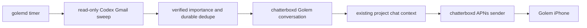

<!-- email-watch-repair-2026-10-04 -->
# Restore standalone Golem email notifications

Shelby explicitly requested investigation, repair and end-to-end validation now. Installed golemd was paused and inherited a nonexistent removed-worktree fake-provider codexPath; the watcher returned silently without an attempt. Background-equivalent Gmail Work access succeeded, then installed sweeps succeeded after the path and pause were repaired. Phone delivery is independently blocked because the APNs key ACL does not authorize chatterboxd.

## Ownership and flow

## Success criteria
1. Installed scheduler enabled; genuine background sweep records successful cursor and important mail.
2. Missing binary, failed process or unavailable Gmail never records successful empty inbox; tests verify cursor behavior.
3. Routine autopay and speculative alerts stay quiet; project briefings read relevant chat context and suppress addressed repeats.
4. Durable message identity dedupe survives repeat sweep/restart; read-only Gmail and prior preferences preserved.
5. Phone push uses Golem topic/device; Apple acceptance and physical receipt recorded separately, with ACL permission/password blocker explicit.

## Deliverables and workflow
- [x] EMAIL-1 Trace installed services, jobs, background tool access and APNs failure; accepted by process/config/source and real mail evidence.
- [x] EMAIL-2 Target watcher failure handling/filter prompt and job context; acceptance: behavioral sweep harness and policy fixtures.
- [x] EMAIL-3 Build/install only Golem service changes after policy/app backup; acceptance: signature, installed sweep and duplicate suppression.
- [ ] EMAIL-4 Resolve narrow APNs grant with Chatterbox; acceptance: same-service key access and Apple acceptance; physical receipt requires Shelby.
- [ ] EMAIL-5 Record evidence and commit source/plan/test changes; keep issue open for physical receipt/permission if outstanding.

## Work preparation
Scope confirmed by direct user repair-now instruction. Linear execution: one session owns Golem source; Chatterbox session coordinates its existing APNs sender. Executor: current GPT-6 session settings; precise runtime model variant/effort unavailable, no model override. An optional settings question is pending; runtime repair is explicitly authorized now. Issue: https://github.com/shelbyklein/golem/issues/1; local: plans/email-watch-repair-2026-10-04.md. Readiness: scope, checks, diagram, tasks, rollback and exclusions recorded; runtime model metadata limitation disclosed.

## Boundaries and open questions
No global auth/proxy edits, email sends/mutations, credential export, broad Keychain grants or unrelated shared Core edits. Preserve weekday 8 AM/3 PM jobs, waiting/finished jobs, read-only contextual school/appointments/life admin and USA Archery priorities, routine quiet, message identities, chats and pairing. Phone ACL permission pending; do independent watcher work while waiting. No source changes in Chatterbox by this session.

## Tests and rollback
Run python3 tests/golem-integration/email-sweep.py (behavioral runner harness) and CHATTERBOX_TEST_DAEMON_BINARY=<isolated-capable binary> python3 tests/golem-integration/email-policy.py (real daemon failure/cursor/restart/dedupe checks). Build signed Golem via xcodebuild, verify codesign, install backed up bundle and restart only golemd. Installed sweep must find real invitation/project mail; rerun with overlap must not enqueue duplicates. Never claim physical phone receipt from APNs 200 alone.

Backups: ~/Library/Application Support/Golem-InstallBackups/email-pipeline-20261004-174559 and prior installed-app backup. Quiesce golemd before policy restore; preserve post-repair journal/queue. APNs ACL changes require separate permission and preserve all existing entries; never export key material.

## Verified repair evidence
- Removed only the missing Golem-specific codexPath pointing at a deleted fake-provider fixture; restarted golemd and resumed its previously enabled jobs.
- Legacy last successful email sweep was 2026-10-04T11:02:21Z; carried over 43 reported IDs across the four configured accounts and ran a catch-up. It recovered Justin’s lunch invitation, recognized the existing October 7 calendar entry, and correlated the WooCommerce disk alert with the Runcloud chat.
- Real installed repaired sweep completed at cursor 2026-10-04T22:02:11Z; emailAccounts persisted all four configured addresses, no emailProblem, paused=false. No new email notifications from that interval.
- Both behavioral harnesses passed: six runner outcomes, actual isolated daemon failed-cursor preservation, overlapping-message dedupe, visible missing executable, restart dedupe. First runner fixture failed due a Python reserved-keyword error in the fixture; corrected fixture and all checks passed.
- Build and deep/strict signature checks passed; backed up and installed /Applications/Golem.app; only golemd restarted.
- Phone remains pending: Golem iPhone registered with enabled sandbox push, but the existing APNs key permits the Chatterbox app, not chatterboxd. Chatterbox confirmed ACL metadata only, no secret export. No grant changed; user permission requested. Apple acceptance/physical receipt not established.
- Runtime model metadata question remains unanswered; continued with current session settings per explicit repair-now authorization. No subagents spawned.
