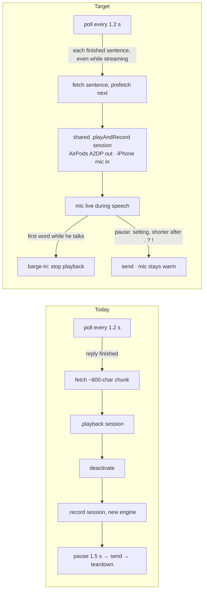
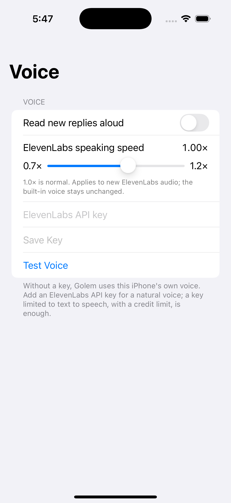
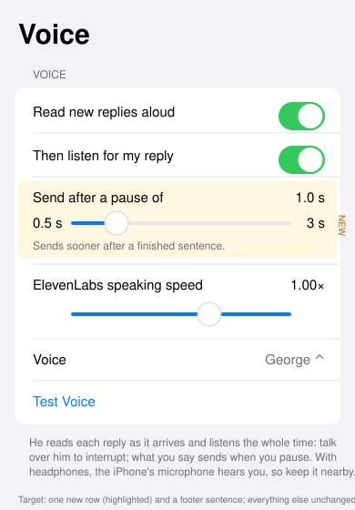

# Golem iPhone voice: streaming speech, talk-over, warm mic, pause setting

Issue: _pending_ · Handoff: [golem-ios-voice-2026-10-06-handoff.md](golem-ios-voice-2026-10-06-handoff.md) · Baseline: Golem `77328d8` (main), Core `076fe5e` (main) · Mac counterpart: [golem-voice-streaming-2026-10-06.md](golem-voice-streaming-2026-10-06.md) (PR #10, not a dependency)

## Summary
Golem on iPhone reads replies aloud and can listen back, but only after his whole reply has arrived, the microphone restarts around every turn, and you can't interrupt him. This brings the Mac round's improvements to the iPhone app: speech starts with each finished sentence while the reply streams in, you can talk over him to stop him, the mic stays live through the conversation, and the send pause becomes a setting. With AirPods, his voice stays full quality and the iPhone's own microphone listens.

## Problem (current behavior, with evidence)
- **Speech waits for the whole reply.** `ChatDetailView` speaks `latestFinishedReply` (`ChatDetailView.swift:46`), which excludes `isStreaming` items; the phone polls every 1.2 s while a reply runs (`MobileHome.swift:134`), so the text is available early but unused.
- **Paragraph fetches.** `GolemVoice.read` (`GolemVoice.swift:90`) fetches ~600-character `chunks` sequentially from ElevenLabs.
- **Audio session conflict.** `GolemVoice.activate()` sets `.playback/.spokenAudio` and deactivates after; `Dictation.start` sets `.record/.measurement` and deactivates on `stop()` (`Dictation.swift`). Playing and recording at once (talk-over) is impossible; each turn tears the session down.
- **Mic restarts per turn.** `Dictation.start` builds the request/tap/engine each call; `stop()` tears them down; `listenForReply()` restarts after every reply.
- **No talk-over; fixed pause** (`Dictation.start(pause: 1.5)`).
- Affects the Golem iPhone app's voice conversation (Conversation button, Shortcuts "Start Conversation", auto-read).

## Visual aids

Settings → Voice, current (2026-10-05 capture):  · target: 

## Settled decisions (user, 2026-10-06)
- iPhone (Golem app) only; Mac and Chatterbox iOS unchanged.
- Talk-over on iPhone uses **the iPhone's built-in microphone with full-quality A2DP audio** to AirPods (`.playAndRecord` + `.allowBluetoothA2DP`, no HFP `.allowBluetooth`; preferred input = built-in mic). On the built-in speaker (no headphones), voice processing (echo cancellation) is enabled and barge-in needs ≥ 2 qualifying words.
- Speech while his turn runs sends immediately (existing send path queues it).
- Pause 0.5–3.0 s, default 1.0 s, `min(pause, 0.7)` after `.`/`?`/`!`; per-device preference `golemTalkPause`.
- Sentence-sized ElevenLabs HTTP requests with ≤ 2 prefetches (same approach as Mac).
- Pure logic (segmentation, pause timing) lives in Foundation-only files under `Core/Shared/` so it is tested on macOS; AVFoundation glue is verified by simulator/device builds and the live test.

## Success criteria
1. **First words fast.** `scripts/test-golem-ios-voice.sh segments` passes (sentence cuts, merge, ≤ 600, cleaner); live on iPhone: audible first words within ~2 s of the first sentence appearing (1.2 s poll + fetch).
2. **Talk-over.** Logic fixture `pause` passes (barge-in fires once at first qualifying word; 2-word rule on speaker); live with AirPods: speaking while he talks stops him within ~0.5 s and the words send.
3. **Warm mic, multi-turn.** Live: three consecutive turns without the mic tearing down (one "Microphone started" per conversation in the device log), Golem audio stays full quality in AirPods.
4. **Pause setting.** Settings → Voice shows "Send after a pause of" (0.5–3 s, default 1.0) on iPhone; persists; terminal punctuation sends sooner (fixture asserts).
5. **No regressions.** GolemMobile simulator + device builds pass; `scripts/test-mobile-ui.sh iphone` passes; Shortcuts Start/End Conversation still work; Test Voice works; Chatterbox iOS builds unchanged.

## Deliverables and end states
- Core branch `claude/golem-ios-voice` (shelbyklein/chatterbox-core): committed, PR opened — merge awaits the user.
- Golem branch `claude/golem-ios-voice` (pin bump, `scripts/test-golem-ios-voice.sh`, tests, plan/handoff/assets): committed, PR opened — merge awaits the user.
- GolemMobile device build installed on the user's iPhone 17 Pro for the live test (IV-05) — **only after the user says go**.

## Tasks (dependency-ordered)
| ID | Owner | Task | Acceptance |
|---|---|---|---|
| IV-01 | Coordinator | Scaffold: `Core/ChatterboxMobile/GolemAudioSession.swift` with the fixed API, implemented to reproduce today's per-role categories (no behavior change); switch `GolemVoice`/`Dictation` to call it; add `scripts/test-golem-ios-voice.sh` (compiles `tests/golem-ios-voice/<name>/main.swift` with `Core/Shared` logic files on macOS); pin Golem's `Core` to the Core branch; push both branches. | GolemMobile simulator build passes; runner exists; branches pushed. |
| IV-02 | Lane A | Streaming speaker: `Core/Shared/SpeechSegments.swift` (pure cut/merge/clean) + `GolemVoice.update(reply:text:final:then:)` with ordered ≤ 2 prefetch, per-segment phone-voice fallback, stop semantics, playback via `GolemAudioSession`. | `scripts/test-golem-ios-voice.sh segments` passes; GolemMobile simulator build passes. |
| IV-03 | Lane B | Warm listener + session: `Core/Shared/UtterancePause.swift` (pure pause/barge-in timing) + `Dictation` conversation mode (one engine, per-utterance requests, `onSpeechDetected`, persisted pause) + real `GolemAudioSession` (.playAndRecord, A2DP, built-in mic, voice processing on speaker) + `DictationPauseControl` view. | `scripts/test-golem-ios-voice.sh pause` passes; GolemMobile simulator build passes; Chatterbox iOS composer path compiles (`start(onText:)` intact). |
| IV-04 | Coordinator | Integrate in `ChatDetailView`: speak streaming items, keep mic live during speech, barge-in, mid-turn send, warm mic across turns, settings row + footer; update Shortcuts path. | All fixtures; simulator + device builds; `scripts/test-mobile-ui.sh iphone`; rendered Settings → Voice capture inspected. |
| IV-05 | Coordinator → **user gate** | PRs; on go-ahead install on iPhone 17 Pro; user runs a 3-turn conversation with AirPods incl. one talk-over. | User confirms criteria 1–4 live. |

## Exclusions and preserved behavior
- Not in scope: Mac Golem (PR #10 stays separate), Chatterbox iOS behavior, ElevenLabs WebSocket, push/notifications, Shortcuts intents' definitions, the 8 s/30 s give-up timers, iPad-specific layout.
- Must not change: auto-read / "Then listen for my reply" settings and keys; ElevenLabs key in the iPhone Keychain; speaking speed; voice picker; Test Voice; table/link reading rules of `GolemVoice.spoken`; per-item Listen/Stop buttons; typed text never sent by the voice loop; ending the conversation when the app backgrounds or the chat closes; pairing and chat data.

## Test plan
- `scripts/test-golem-ios-voice.sh [segments|pause|all]` — macOS `swiftc` of the pure `Core/Shared` files plus fixture; no network, no audio.
- `env -u CHATTERBOX_DATA_DIR xcodebuild -project Golem.xcodeproj -scheme GolemMobile -sdk iphonesimulator -derivedDataPath build/IOSVoiceSim CODE_SIGNING_ALLOWED=NO build`
- Device: `xcodebuild -scheme GolemMobile -configuration Debug -destination generic/platform=iOS -derivedDataPath build/IOSVoiceDevice -allowProvisioningUpdates build`
- `scripts/test-mobile-ui.sh iphone` (existing acceptance UI tests, simulator).
- Rendered state: simulator Settings → Voice capture (DEBUG settings entry as in the speed plan).
- Live (IV-05): Conversation button in Golem's chat with AirPods; 3 turns; one talk-over; Test Voice.

## Rollback
IV-05 installs over the existing Golem iPhone app (pairing/data kept by in-place install). Rollback = reinstall the build from `main` (`xcodebuild` at `77328d8` + `devicectl install`). New preference `golemTalkPause` is harmless if unused. No server, schema or data changes.

## Open questions (non-blocking)
- Whether on-device `SFSpeechRecognizer` keeps a request alive > 1 min on iOS 26; Lane B rotates empty requests at 50 s and reports.
- Exact barge-in latency with the 1.2 s poll is dominated by local audio, not polling; measured live.

## Work preparation
- Scope confirmed by the user 2026-10-06 ("Yes, that's it"); AirPods tradeoff decided ("iPhone mic, full-quality audio").
- Repository: shelbyklein/golem worktree `.claude/worktrees/ios-voice` (branch `claude/golem-ios-voice` from `77328d8`), Core submodule branch `claude/golem-ios-voice` from `076fe5e`.
- Mode: **orchestrated** — speaker and listener are independent files after IV-01, built in parallel like the Mac round (the user asked for the same approach: "have sonnet agents do the work").
- Models: coordinator Claude Opus 5.5 (`claude-opus-5-5`, this session); Lane A and Lane B Claude Sonnet 5.5 (`claude-sonnet-5-5`); the agent runner exposes no effort setting, so lanes are instructed to work thoroughly.
- Handoff: prepared at `plans/golem-ios-voice-2026-10-06-handoff.md`.
- Now/later: now.
- Readiness: pass · 2026-10-06 · R1–R13; R3 diagram + settings capture/mockup; R12 covers the iPhone install.
