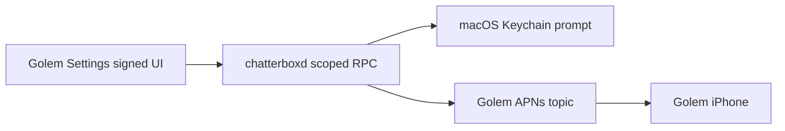

<!-- golem-push-settings-2026-10-05 -->
# Golem-owned push setup

Golem Settings has mobile pairing but no push controls. RuntimeServer only permits Chatterbox UI to authorize the shared sender, and MobilePush.test always selects Chatterbox. Add Golem Settings authorization, Golem delivery status and per-device Send Test using the existing APNs key and Golem topic.

Before: Golem Settings [pairing, remove device]. Target: [pairing] [Push notifications: delivery status; Authorize Keychain Access; iPhone: Send Test].

Success: signed Golem UI can authorize the sender; agents cannot; tests cannot target another product; installed settings show sender status; Apple acceptance and phone receipt reported separately.

Linear execution: existing GPT-6.1 Sol Medium session, no delegation. User approved implementation and Golem push validation. Chatterbox coordination requested before service activation. Deliver scoped source, regression evidence, built/installed apps with backup; commit after validation without absorbing others' pending edits.

- [x] PUSH-1 Implement scoped sender RPC and Golem settings; gate: unauthorized roles and cross-product tests rejected.
- [x] PUSH-2 Build Golem and daemon; run isolated push RPC behavior tests, including disabled/unpaired routes without accessing live key.
- [ ] PUSH-3 Install backed-up apps/service when safe; inspect Golem Settings and actual signed-client status.
- [ ] PUSH-4 Request Keychain authorization, send one Golem test, record Apple acceptance and user-confirmed phone receipt separately.

No global auth/proxy edits, key export, key replacement, broad permission grants, data migration or email preference changes. Preserve earlier sidebar edits and concurrent Chatterbox work. Rollback restored app bundles and previous daemon after safe service stop; no data reset. User completes macOS password prompt. No blocking design questions; physical receipt remains an external acceptance gate. Related issue: https://github.com/shelbyklein/golem/issues/1. Local: plans/golem-push-settings-2026-10-05.md.

Readiness: scoped existing-settings refinement; current view confirmed from GolemApp.swift, target sketched above; RPC flow diagram included. Tests: isolated tests/golem-integration/push-rpc.py and xcodebuild Golem/Chatterbox Debug. Installed native Settings inspection is required; physical push pending system authorization.

Build and wire checks passed. Isolated fixture: /tmp/golem-push-rpc.dkc0d4p8. Payload check verifies Golem sandbox APNs topic and privacy-preview branding. Golem UI installed with backup push-settings-20261005-105423; native Settings shows Authorize Keychain Access and iPhone Send Test with an explicit service-update-needed message. Sender built in isolated /tmp/chatterbox-golem-push.ag0kj4en/repo at Chatterbox b6714c2 plus only scoped push changes. Restart choice requested because multiple live turns are active; no service restarted yet. Phone test not sent.

User chose wait-then-activate. One-time launchctl job com.shelbyklein.golem.push-activation-once waits for all daemon-reported running turns to finish, checks installed bundle drift, installs only tested sender into a preserved copy of the current app, restarts chatterboxd, verifies health and posts its result to this development chat. Evidence/status: ~/Library/Application Support/Golem-Push-Activation/20261005-110120. Keychain may already be authorized: earlier APNs accepts found in sender log. Current mobilePushEnabled=false suppressed the explicit test; added separate golemPushEnabled preference, preserving Chatterbox off. Isolated permission and independent-toggle checks passed at /tmp/golem-push-rpc.fwwdl9z1. No real test accepted this turn.
