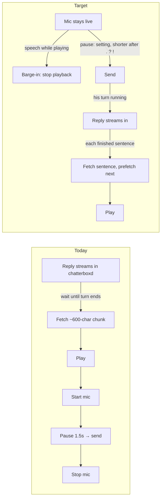
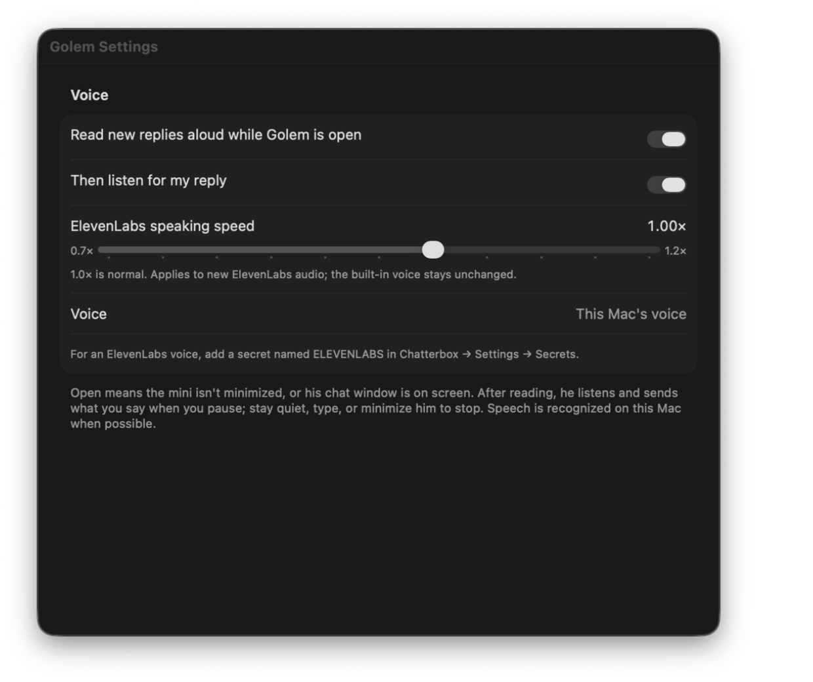
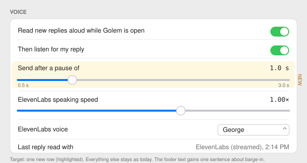

# Golem Mac voice: streaming speech, barge-in, warm mic, pause tuning

Issue: https://github.com/shelbyklein/golem/issues/9 · Handoff: [golem-voice-streaming-2026-10-06-handoff.md](golem-voice-streaming-2026-10-06-handoff.md) · Baseline: Golem `77328d8` (main), Core `4b1212d`

## Summary
Golem on the Mac reads his replies aloud and listens for yours, but it feels stilted: he says nothing until his whole reply has been written, the microphone is torn down and rebuilt around every turn, you can't talk over him, and the send-on-pause delay is a fixed 1.5 s. This plan makes the exchange conversational without changing what Golem is: speech starts on the first finished sentence, the mic stays live through the conversation, speaking interrupts him, and the pause is a setting that shortens after a finished sentence.

## Problem (current behavior, with evidence)
- **Speech waits for the whole reply.** `GolemTalk.replyChanged()` (`GolemApp/GolemTalk.swift:118`) is gated on `!dot.isRunning`, and `latestReply` ignores items while they stream. A 30-second reply is silent for 30 seconds, then read.
- **Per-paragraph fetches.** `ElevenLabs.chunks` (`GolemTalk.swift:471`) groups paragraphs up to ~600 characters; the first audio needs the first ~600 characters fetched in one request.
- **Mic rebuilt per utterance.** `startListening` (`GolemTalk.swift:241`) creates a new `AVAudioEngine`, tap and recognition request each time; `finishListening` → `stopListening` stops the engine. `finishedSpeaking` (`:204`) then waits 300 ms and starts it all again. Logs show one `Microphone started` per turn.
- **No barge-in.** While `speaking`, nothing listens; the only way to stop him is the Mute/End button.
- **Fixed pause.** `static let pause: TimeInterval = 1.5` (`:33`); no setting, no shortening after a terminal sentence.
- Affects: the user's Mac voice conversations with Golem (`conversationActive` flow, Shortcuts "Start Conversation").

## Visual aids
Flow today vs target:

Settings → Voice, current:  · target (one new row): 

## Settled decisions
- Mac only; iPhone keeps today's behavior.
- Speech while his turn is still running sends immediately as an addition to that turn (`ChatSession.send` while running already queues it).
- Barge-in is tuned for headphones: triggers on the first recognized word (≥ 2 characters); voice-processing echo cancellation is enabled when the input supports it as a guard for speakers.
- Streaming uses sentence-sized ElevenLabs HTTP requests with prefetch, not the WebSocket API (simpler, reuses the speed payload and key path; revisit if latency is still poor).
- Pause setting range 0.5–3.0 s, default 1.0 s; shortened to `min(pause, 0.7)` when the transcript ends in `.`, `?` or `!`.
- Voice implementation stays in `GolemApp/`. User follow-up adds a small Core mini presentation hook: hide only the completed spoken reply, keep avatar/composer/listening open; a new reply or reopening restores text. Interrupted, muted and length-capped replies remain available.

## Success criteria
1. **First words fast.** Fixture (`scripts/test-golem-voice.sh speaker`, stub provider): the first segment is requested ≤ 200 ms after the first sentence completes while the reply is still streaming, and segments play in order with ≤ 2 fetches in flight. Installed app, user check: audible first words within ~1.5 s of the first sentence appearing.
2. **Barge-in.** Fixture (`listener` + `talk`): speech detected while playing stops playback ≤ 100 ms later and the same utterance sends on pause. Installed app: talking over him stops him; what you said is sent.
3. **Warm mic.** Fixture: two consecutive utterances send with the engine running throughout (one `Microphone started` log per conversation). Installed app: second and third turns work with no gap or click.
4. **Pause setting.** Settings → Voice shows "Send after a pause of" (0.5–3.0 s, default 1.0 s), persists across launches, and a terminal sentence sends sooner (fixture asserts both).
5. **No regressions.** `scripts/test-golem-voice.sh` (all fixtures, including the migrated mini/voice ones) passes; `xcodebuild -scheme Golem` passes; Shortcuts Start/End Conversation fixtures pass.

## Deliverables and end states
- Code on branch `claude/golem-voice-streaming` in shelbyklein/golem (`GolemApp/GolemSpeaker.swift`, `GolemListener.swift`, `GolemVoiceSettings.swift`, slimmed `GolemTalk.swift`, `tests/golem-voice/*`, `scripts/test-golem-voice.sh`): committed, PR opened — merge awaits the user.
- This plan, the handoff, and assets: committed with the feature.
- Debug Mac build: built, fixtures passed.
- Signed install over `/Applications/Golem.app`: **awaits the user's go-ahead** (VS-05 gate), with backup.

## Tasks (dependency-ordered)
| ID | Owner | Task | Acceptance |
|---|---|---|---|
| VS-01 | Coordinator | Split `GolemTalk.swift` into `GolemSpeaker.swift` (speech + ElevenLabs), `GolemListener.swift` (mic + recognition), `GolemVoiceSettings.swift` (settings + toolbar), with `GolemTalk` as the thin coordinator. No behavior change. Add `scripts/test-golem-voice.sh` and move the existing ad-hoc fixtures into `tests/golem-voice/`. | `xcodebuild -scheme Golem` passes; `scripts/test-golem-voice.sh` runs the migrated fixtures and all pass; `git diff --stat` touches only `GolemApp/`, `tests/`, `scripts/`, `project.yml`/pbxproj. |
| VS-02 | Lane A | Streaming speaker: sentence segmentation of streaming reply text, ordered play with ≤ 2 prefetches, Mac-voice fallback per segment, `stop()` cancels everything, `lastSpoken` says "ElevenLabs (streamed)". | `scripts/test-golem-voice.sh speaker` passes (stub provider: first request ≤ 200 ms after first sentence; order preserved; stop cancels; final text with no sentence punctuation still speaks; markdown/links cleaned as today). |
| VS-03 | Lane B | Warm listener: one engine per conversation, recognition request rotated per utterance; `onSpeechDetected` for barge-in (first word ≥ 2 chars); pause setting + punctuation shortening; voice processing when supported; existing error messages kept. `GolemListenerSettings` view with the slider. | `scripts/test-golem-voice.sh listener` passes (two utterances, engine running throughout; pause default/persist/shorten; speech-detected callback; typed-text guard still stops). |
| VS-04 | Coordinator | Integrate: `GolemTalk` wires speaker ↔ listener (streaming updates, barge-in stop, mid-turn send, warm mic across turns, `isOpen` watcher, mute semantics), composes settings, updates footer text. End-to-end fixture. | `scripts/test-golem-voice.sh` (all) passes; build passes; manual smoke on the Debug build: one real ElevenLabs conversation (user-approved spend) with first words < 1.5 s and barge-in working. |
| VS-05 | Coordinator → **user gate** | PR; then, on the user's go-ahead, back up and install over `/Applications/Golem.app`, relaunch via Launch Services, verify signature and live criteria 1–4. | PR open with fixture output; install only after approval; user confirms criteria 1–4 live. |

## Exclusions and preserved behavior
- Not in scope: iPhone Golem, broader Core engine changes, ElevenLabs WebSocket streaming, server-side VAD, changing the 8 s / 30 s give-up timers, push notifications, the Shortcuts intents themselves, Chatterbox.
- Must not change: Mute and Conversation buttons and their semantics; "Read new replies aloud" / "Then listen for my reply" settings and keys; ElevenLabs key sourced from Chatterbox Secrets; speaking-speed setting; 🎤-from-typed-text (prefix) behavior; typed-text-stops-listening guard; the mini's draft display; replies present at launch stay silent; nothing spoken while minimized; iPhone pairing/push; conversation data.

## Test plan
- `scripts/test-golem-voice.sh [speaker|listener|talk|buttons|all]` — compiles each `tests/golem-voice/<name>/main.swift` against the Debug `Golem.debug.dylib` (as the existing ad-hoc fixtures do) and runs it with `CHATTERBOX_DATA_DIR` set to a throwaway directory (never the live store). Stub speech provider; no paid ElevenLabs calls in fixtures.
- `env -u CHATTERBOX_DATA_DIR xcodebuild -project Golem.xcodeproj -scheme Golem -derivedDataPath build/GolemPlan build`
- UI entry point: Golem → Settings (⌘,) → Voice; rendered-state check via an NSHostingView capture (same method as `assets/golem-voice-streaming/settings-current.png`).
- Live (VS-04 smoke, VS-05 acceptance): Conversation button in the mini; speak, hear first words, talk over him, second turn.

## Rollback
VS-05 replaces `/Applications/Golem.app`: back up to `~/Library/Application Support/Golem-InstallBackups/<timestamp>/Golem.app` first; rollback = copy back and relaunch. New preference key `golemTalkPause` is harmless if unused. No data, schema or service changes; `golemd`/`chatterboxd` untouched.

## Open questions (non-blocking)
- Whether `SFSpeechRecognizer` on-device recognition keeps partial results flowing reliably for > 1 minute per request; VS-03 rotates requests to stay under the limit and must record what it observed.
- Whether `setVoiceProcessingEnabled(true)` is accepted on the user's input devices; VS-03 falls back silently and logs.

## Work preparation
- Scope: confirmed by the user on 2026-10-06 ("do it") after the scope statement; decisions above from the three gate questions.
- Repository: shelbyklein/golem, main checkout `/Users/shelbyklein/Vibes/Golem`, baseline `77328d8`; lanes work in isolated worktrees under `.claude/worktrees/`.
- Mode: **orchestrated** — the speaker and listener lanes have no file overlap once VS-01 lands, and run in parallel (reason: two independent subsystems; parallelism roughly halves the implementation wall time).
- Models: coordinator = this session, Claude Fable 5.1 (`claude-fable-5-1`); Lane A and Lane B = Claude Sonnet 5.5 (`claude-sonnet-5-5`), effort high. The user asked for "sonnet agents"; Sonnet 5.5 is the current Sonnet.
- Handoff: prepared at `plans/golem-voice-streaming-2026-10-06-handoff.md`.
- Now/later: the user's "make a plan, write a spec, and have sonnet agents do the work" + "do it" is read as **now**.
- Readiness: pass · 2026-10-06 · R1–R13 checked; R3 flow diagram + settings screenshot/mockup; R12 covers the install.

## Continuation and validation (2026-10-06)
Both requested Sonnet lanes completed and were committed/pushed; speaker and listener merges already existed on the integration branch. Current Codex coordinator resumes the unfinished integration only; no replacement lanes were spawned. Exact resumed coordinator model/effort metadata is not exposed; existing session workflow waiver retained.

User follow-up: hide the mini reply bubble after its audio completes. Adds a Core presentation-only hook keyed by message ID, with short existing fade, content-height shrink and no session/draft changes. Full transcript stays intact. A capped reply keeps text on screen. Muting/barge-in do not falsely acknowledge unread audio.

Build: `build/GolemPlan`, Mac Debug passed. Fixtures use fake recognition, stub provider and silent native synthesis; no ElevenLabs calls/credits. Actual microphone/AirPods, speaker echo cancellation, paid latency and interruption remain pending. Shortcuts Start/End dispatch/error/cancellation check passed.

Settings render: assets/golem-voice-streaming/settings-implemented.png is an isolated SwiftUI render (no secrets), not an installed-app screenshot. Native UI capture failed with Sky Computer Use native pipe startup failed.

VS-02/VS-03 fixture acceptance passed. VS-04 integration implemented and local checks passing, but its real smoke-test criterion remains pending user approval. VS-05 PR prepared; installation and live acceptance await the explicit plan gate.

Final local verification: all eight fixture groups PASS (buttons, conversation, listener, speaker, talk, double-click, expand, open). Conversation covers bubble hiding and height shrink, muted/interrupted text retention, warm capture, mid-turn send, typed prefix, End preserving drafts and typing cancellation. Shortcuts dispatch/error/cancellation fixture PASS. Mac build and signature verification PASS. No real paid speech or microphone test initiated.

## Authorized installation and paid smoke test
User approved with “do it” after the concrete install/one-short-test choice. Installed signed Debug app over /Applications/Golem.app after backup to ~/Library/Application Support/Golem-InstallBackups/voice-streaming-20261006-103344/Golem.app; Launch Services used, inherited CHATTERBOX_/GOLEM_ env removed. Services untouched. Explicit one-shot DEBUG launch argument plays only “Golem’s voice is ready.” without creating/sending a chat. Receipt work/voice-streaming-smoke/20261006-103344/receipt.txt: actual ElevenLabs streamed provider; first playback callback 0.444 s; finished true; fallback false. This is callback timing, not measured acoustic onset. Mic/AirPods barge-in, second/third real turns and user receipt remain pending. No other paid speech tests initiated.

## AirPods capture correction after live report
User reported no speech pickup. Installed logs: microphone start and configuration restart, no transcription updates; repeated Core Audio VoiceProcessor ProcessDownlinkAudio failures (invalid sample time). Default input was Shelby’s AirPods Pro #4. Echo-cancellation engine started but failed at runtime. Normal capture now defaults on; optional Speaker echo cancellation setting retains opt-in for speaker use and applies next conversation. Added first audio-buffer metadata log only (frames/sample rate, no recorded sound/transcript). Mac build, listener and conversation fixtures passed. Installed/relaunched with backup airpods-capture-20261006-103637. No paid speech test repeated. Live word pickup awaits user test.
