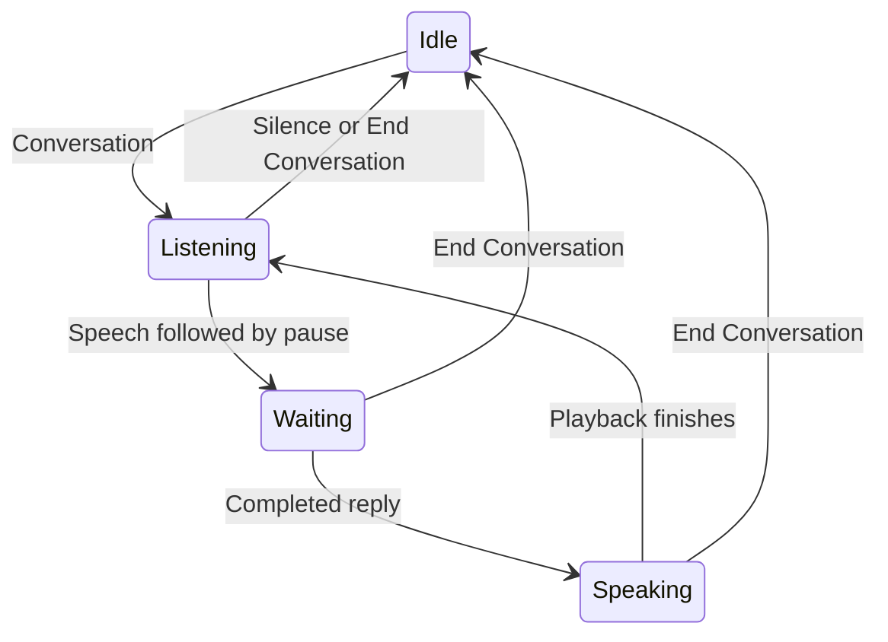
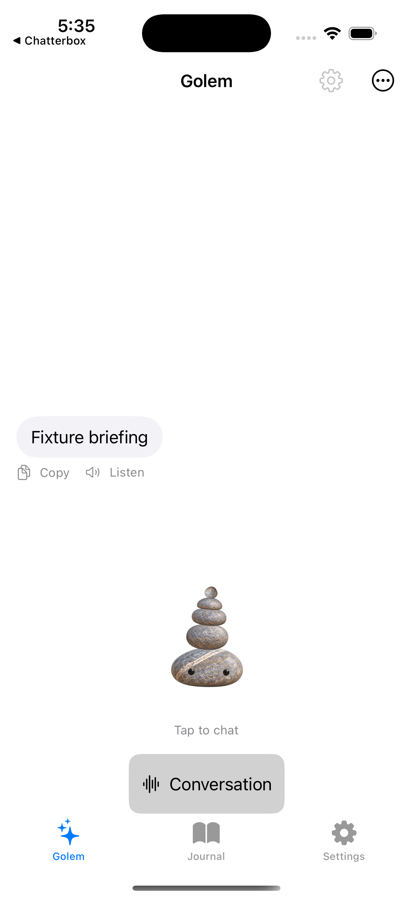
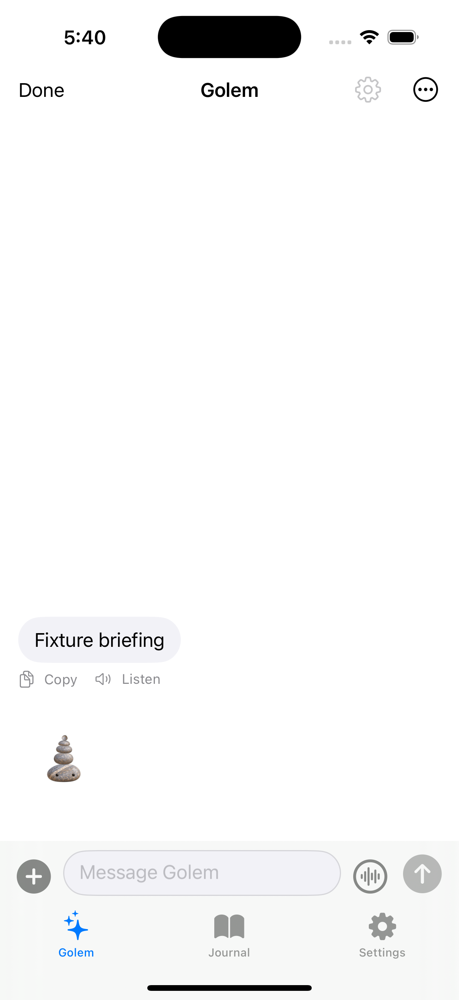
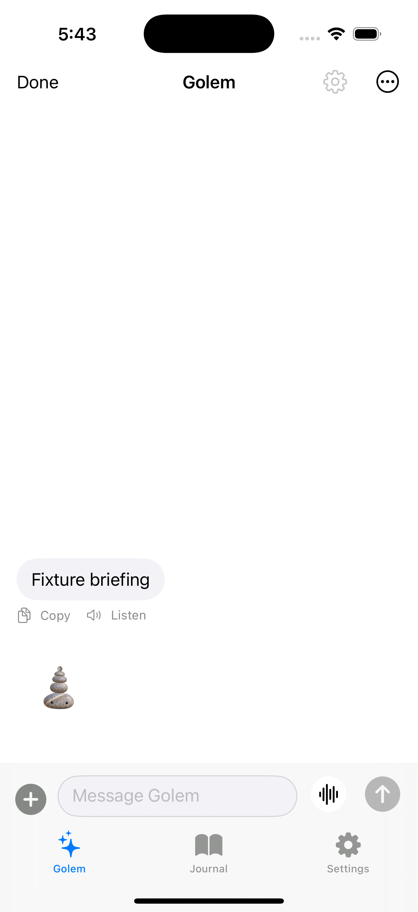

<!-- ios-conversation-button-2026-10-05 -->
# Start an iPhone voice conversation

Golem currently listens only after reading a reply. Add a visible Conversation button so Shelby can speak first, and an End Conversation button throughout the session. Existing speech provider, keys, preferences, and send-on-pause timing remain unchanged.

## Evidence and intended flow
- `Core/ChatterboxMobile/ChatDetailView.swift`: `idleGolem` has only the avatar and listening feedback; `listenForReply` starts capture after speech completion.
- `Core/ChatterboxMobile/Dictation.swift`: asynchronous permission requests currently have no cancellation generation guard.

Target control: `[Conversation]` below the avatar, becoming `[End Conversation]` while active, including while waiting for a reply. Keep an end control reachable in composing mode too.

## Success criteria
1. Start listens immediately without requiring an earlier reply or changing saved auto-read preferences.
2. Spoken input sends once on pause, followed by read/listen cycles.
3. End stops playback/capture and pending callbacks, preserving unsent text; backgrounding or leaving chat also ends the session.
4. Permission failure and silence return to an understandable idle state.
5. Existing drafts and attachments are never silently sent by starting a session.

## Tasks
- [ ] T1 Implement explicit session state and start/end controls; verify all phases offer End Conversation.
- [ ] T2 Harden capture cancellation across permission awaits and stale recognition callbacks; verify stop sends nothing.
- [ ] T3 Build the iOS target, run isolated lifecycle checks, inspect simulator UI, and install the updated device build if the phone is available. Physical microphone acceptance remains Shelby testing.

## Boundaries
No Mac behavior changes, key changes, global auth changes, provider migration, automatic paid speech tests, or background microphone capture. End Conversation stops the voice session; it does not cancel an already-submitted agent turn.

## Deliverables and validation
Code and successful iOS build; inspected simulator UI and lifecycle evidence. Device install if available, with actual voice acceptance reported separately. Determine existing Xcode scheme and simulator test entry before running the build. No commit/merge required by this request.

## Rollback
Revert only this task patch and rebuild the previous revision; retain app data, pairing, settings, and keys during an in-place device update.

## Work preparation
Scope confirmed by “get to work”; implement now. Linear execution: this is one cohesive mobile interaction. Executor is current session; exact model/effort are not exposed. R9 waiver accepted by Shelby: “Do it” following the explicit current-agent question. Implementation authorized. Current UI evidence is the inspected idleGolem source; target sketch and flow are above. Rendered UI verification remains T3. Local plan: `plans/ios-conversation-button-2026-10-05.md`.

## Verification progress
- Simulator and device builds passed before the final cancellation guard; final device rebuild also passed.
- Inspected real simulator screenshot: .
- No paid speech test performed. Physical microphone/send-on-pause acceptance remains pending.
- Computer Use lost its simulator window (`cgWindowNotFound`) after initial successful screen inspection; interactive start/end verification is not yet claimed.

Tracked issue: https://github.com/shelbyklein/golem/issues/6

Final delivery: installed successfully on Shelby’s iPhone 17 Pro. Source remains uncommitted. UI button rendering inspected in simulator; live listening, pause-to-send, and end-session behavior await physical voice acceptance. No new paid speech requests initiated.

## Accepted layout revision
Shelby confirms the initial voice conversation works on iPhone. Move the session control into the composer by replacing its existing mic/dictation button, with no additional control. Keep text entry, Send, pause-to-send, and retained unsent words unchanged. Implementation and iPhone install explicitly authorized. Linear/current-agent execution continues under the recorded waiver. Start uses a waveform circle; active session uses a stop circle, with Conversation / End Conversation accessibility labels. The idle avatar still opens the composer; listening automatically reveals it so End stays reachable.

Validation: rebuild simulator and signed device targets; inspect actual simulator composer screenshot with isolated fixture and verify text entry, a single voice control, and Send; install in place on iPhone. No new paid speech test. Rollback remains a rebuild of the previous revision without deleting app data.

### Layout revision results
Simulator and signed device builds passed; `git -C Core diff --check` passed. Inspected actual simulator render using isolated fixture launch with `GOLEM_TEST_COMPOSER=1`: text field, exactly one waveform Conversation control in former mic position, and Send visible with no separate control below avatar. Screenshot: . iPhone in-place install succeeded. Voice-loop logic unchanged by layout move; accepted live behavior from Shelby carries forward, no additional paid speech or microphone test initiated. Source changes remain uncommitted.

## Composer button appearance refinement
Shelby explicitly authorizes implementation and installation: remove the ring, use a solid white circular button with black waveform, retain a black square for End Conversation. Conversation and Send now share explicit 34-point visible bounds and 44-point hit/layout bounds for exact size and alignment. No session behavior changes. Verify the actual simulator screenshot and build/install the signed phone app; no speech test needed for this visual-only change.

Appearance refinement verification: both simulator and signed device builds passed, diff whitespace check passed, installed and launched successfully on iPhone 17 Pro. Inspected actual simulator screenshot: solid white circle, black waveform, no outline, aligned with Send with matching 34-point visible circles / 44-point layout frames. Active state uses black stop.fill against the same white circle. Screenshot: . No behavior changes or paid speech tests. Uncommitted.
