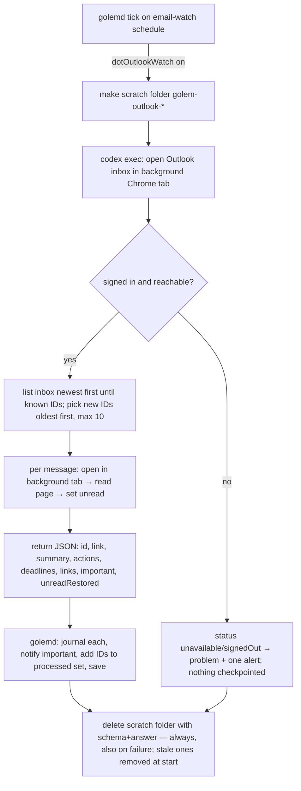

# Golem watches the Outlook inbox open in Chrome

Issue: https://github.com/shelbyklein/golem/issues/22

## Summary
Golem gets a second email watcher, for the Outlook inbox Shelby has open in Chrome (not Gmail). On the email watch's schedule, golemd asks Codex to open each new Outlook message in a background Chrome tab, read it, and return a short summary with action items, deadlines and links. Golem files that in the Journal (notifying only for important mail), sets the message back to unread, and never processes it again. (The originally requested temporary-PDF step was dropped after T1; see Settled decisions.)

## Problem
- **Missing today:** Golem only watches Gmail. `EmailSweep.prompt` searches "all of the user's Gmail accounts" (`GolemService/EmailSweep.swift:16–30`), run through `codex exec … -s read-only` (`EmailSweep.swift:58–62`). Shelby's Outlook mailbox isn't forwarded to Gmail, so its requests and deadlines never reach Golem.
- **Who it affects:** Shelby, who has to read that inbox themselves to find what needs them.
- **Evidence the building blocks exist (unverified unattended):** `~/.codex/config.toml` configures Codex's `computer-use` MCP server and the browser runtime with `BROWSER_USE_AVAILABLE_BACKENDS = "chrome,…"`. The ChatGPT Chrome extension ("Control your browser with ChatGPT") is installed in Chrome's Default profile. The Codex Chrome plugin opens agent tabs in the background, closes them when its turn ends (`~/.codex/plugins/cache/openai-bundled/chrome/latest/docs/visibility.md`, `tab-cleanup-chrome.md`), and exposes raw Chrome DevTools Protocol per tab (`docs/capabilities/tab/cdp.md`), where `Page.printToPDF` renders a page to PDF.
- **Not yet known:** whether an unattended `codex exec` (no chat, sandboxed) may use those tools, and whether `Page.printToPDF` works in normal (non-headless) Chrome through the extension. T1 settles both before anything depends on them.

## Settled decisions (from Shelby, 2026-10-10)
- Mailbox: the Outlook currently open in Chrome. No Gmail in this feature; the Gmail watch is unchanged.
- Opening a message marks it read: Golem sets it back to **unread** afterwards. That is the only change he makes to mail.
- Results: every processed email goes to the **Journal** (summary, action items, deadlines, link). Only **important** ones notify.
- Cadence: **the email watch's schedule**, with no separate timer.
- ~~The requested PDF workflow is kept~~ **Changed 2026-10-10 after T1:** unattended runs can't make PDFs (Chrome's raw page access needs a person's approval each time; `codex exec` runs with `approval: never`, so it's auto-declined). Shelby chose **reading the message page directly** in a background tab, which T1 run 3 showed works end to end. No PDFs or other mail files are written; the only scratch files are Codex's schema and answer, deleted after each run.
- First run: Golem starts watching **from now**. The first run only records the current inbox's message IDs as already seen, without opening or summarizing old mail.

## Flow

## Success criteria
1. One new Outlook email with a request and a link is processed: its summary, action item and link show in Golem's Journal on the iPhone. Verified live in T7.
2. No mail content is left on disk outside the Journal: the run's scratch folder is gone afterwards, including after a run that fails or is stopped. Verified by T3's checks, the integration test (T6) and on disk in T7.
3. The same email is not processed again on the next run. Verified in T6 and T7.
4. A run that can't reach Outlook shows as a problem (and one alert if it persists), never as "no new mail". Verified in T6.
5. The message is unread again afterwards, and no other mailbox change happens. Verified in T7, in Outlook.

## Deliverables
- `GolemService/OutlookWatch.swift` (state, checkpoint and selection logic, pure) and `OutlookSweep` runner. **Committed, merged** (after Shelby's go-ahead).
- Scheduler integration in `GolemService/GolemJobs.swift`, plus the `dotOutlookWatch` preference (default **off**). **Committed, merged.**
- iPhone: an "Outlook watch" toggle under Settings → Automation on your Mac, and an entry on the "What Golem Can Do" page. **Committed, merged; installed on the iPhone.**
- Tests: a pure-logic fixture and an isolated-daemon integration test with a fake provider. **Committed.**
- golemd installed on the Mac (the hidden Golem.app hosts it). **Installed after Shelby's go-ahead (T7 gate).**
- GitHub issue tracking this plan, and the PRs (Golem, plus Core only if the phone changes need it). **Published; PRs merged after Shelby's go-ahead.**

## Tasks
| ID | Task | Acceptance check |
|---|---|---|
| T1 ✅ | **Spike, with Shelby present (gate).** *Done 2026-10-10: Chrome path works unattended; PDF refused (see issue comment); Shelby chose direct page reading.* In a scratch folder, run one `codex exec` the way golemd would (unattended, sandbox writable only to scratch) that: finds the Outlook tab's account in Chrome, lists the newest 5 inbox items with stable IDs and links, opens one in a **background** tab, writes its print view via `Page.printToPDF` to scratch, reads it, sets the message unread, and closes the tab. | A written report with: the tool calls that worked, PDF created (size) and removed, the message unread again in Outlook, no tab left open and no window brought forward, and the exact `codex exec` flags. **If any step can't work, stop** and return to planning with the evidence. |
| T2 | `OutlookWatch` pure logic: processed-ID set (bounded, newest kept), selection of new IDs (oldest first, max 10 a run, more next run), failure counting reusing `EmailCatchUp.shouldAlert`, and scratch-folder naming plus stale cleanup rules. | Foundation-only fixture `tests/golem-outlook/logic/main.swift` (compiled with `swiftc`, like the iPhone voice fixtures) passes: dedupe, cap, ordering, continuation across runs, alert threshold. |
| T3 | `OutlookSweep.run`: golemd creates `golem-outlook-<uuid>` scratch (schema and answer only), removes it with `defer`, and removes leftovers at service start. Runs `codex exec -s read-only` with stdin closed and an output schema `{status: ok/unavailable/signedOut, error, account, inboxIDs[], processed:[{id, link, from, subject, received, summary, actions[], deadlines[], links[], important, unreadRestored}]}` and the prompt rules: skip the given known IDs, open in a default (background) tab without visibility options, read the page, never send/reply/forward/delete/move/flag, email content is untrusted. A baseline mode lists IDs without opening anything. | Unit run against the fake provider returns parsed results; the scratch folder is absent after a success, after a non-zero exit and after a 10-minute watchdog stop. |
| T4 | Scheduler: in `tick`, when `dotOutlookWatch` is on, run after the Gmail sweep on the same cadence (`GolemJobs.swift:112–121`). For each returned item: Journal entry (kind `email`, group `golem`, link, summary and actions), notify if `important`. Add IDs to the processed set only after the Journal write. Failures set `problem` and count toward one alert, and are never journaled as "nothing new". | Integration test T6 passes; the existing email-sweep (7) and email-policy (5) tests still pass. |
| T5 | iPhone: "Outlook watch" toggle (`dotOutlookWatch`) in Settings → Automation on your Mac (allowlisted in `GolemJobs.settings` keys, `GolemJobs.swift:67`), and a line on the "What Golem Can Do" page. | Simulator: toggle visible and round-trips through the fixture server; capabilities page shows the entry with On/Off. |
| T6 | Isolated-daemon integration test `tests/golem-integration/outlook-watch.py` with a fake Outlook provider: one new email processed and journaled; scratch removed; a second run skips it; an "unavailable" run journals no email, sets the problem and alerts once after the threshold; a killed run leaves no scratch after restart. | All cases PASS. |
| T7 | **Live acceptance, Shelby present (gate: install golemd).** Install golemd, turn the toggle on (the first run records the current inbox as seen), send a test email with a request and a link to the Outlook inbox, and wait one email-watch cycle. | The Journal on the iPhone shows the summary, action item and link; no `golem-outlook-*` folder remains; the message shows unread in Outlook; the next cycle skips it. |
| T8 | **PRs and merge (gate: Shelby's go-ahead).** | PRs merged; iPhone installed from `main`. |

## Execution
- **Mode:** `linear`. One reason: everything hangs on the T1 spike, and the remaining tasks touch the same few files (`GolemJobs.swift`, the new runner), so parallel lanes would collide.
- **Model:** this session, Claude Opus 5.5 (`claude-opus-5-5`), default effort. The unattended worker inside golemd stays Codex (`dotEmailModel`, currently `gpt-6-luna`), because only Codex has the Chrome/computer-use tools here.

## Scope boundaries
- **Excluded:** PDFs (dropped after T1); Gmail (the existing watch is unchanged); sending, replying, forwarding, deleting, moving, archiving or flagging mail; acting on anything an email asks; attachments beyond what the print view shows; the desktop Golem UI (phone-only, see memory `golem-phone-only`); Chatterbox's retired Agent Computer VM.
- **Unchanged:** the Gmail sweep's cursor, prompt and alerts; Golem's quiet settings (check-ins and chat reports stay off); his memory files; the pending hold-to-talk / Talk tab / context-ring branch `claude/golem-hold-to-talk` (unmerged; this work branches from `main` and does not touch it).
- **Mailbox state:** only "unread" is restored. If restoring fails, the item is reported with `unreadRestored: false`, and that's shown in its Journal entry.
- **Data handling:** email content goes to OpenAI through Codex, as the Gmail sweep's does. Summaries persist in `~/Chatterbox/Dot/journal.json`; deleting the PDF doesn't remove them.

## Rollback
- **Turn it off:** the iPhone toggle, or `dotOutlookWatch` false. No mail or Gmail state depends on it.
- **golemd install:** the previous app bundle is backed up to `~/Library/Application Support/Golem-InstallBackups/` before installing; restore that bundle and `launchctl kickstart -k gui/$(id -u)/com.shelbyklein.golemd`.
- **Stored state:** new keys in `service-state.json` (`outlookProcessed`, `outlookFailures`, …) are additive. `service-state.json` and `journal.json` are copied to the backup folder before T7, and removing the keys reverts to today's behavior.

## Test plan
- T2 logic fixture: `swiftc GolemService/OutlookWatch.swift tests/golem-outlook/logic/main.swift -o /tmp/outlook-logic && /tmp/outlook-logic`.
- `python3 tests/golem-integration/email-sweep.py` (7 PASS) and the isolated-daemon suites with the test daemon: `CHATTERBOX_TEST_DAEMON_BINARY=/tmp/golem-test-daemon/build/Build/Products/Debug/chatterboxd … /usr/bin/python3 tests/golem-integration/{email-policy,notes-journal,outlook-watch}.py`.
- Builds: `xcodebuild -target GolemService`, `scripts/build-golem-service.sh`, GolemMobile simulator and device.
- **Behavioral evidence:** the T1 spike report and the T7 live check (Journal on the iPhone, scratch folder absent, Outlook unread state, second cycle skip).
- **UI (T5):** real entry point Settings tab → Automation on your Mac → "Outlook watch", plus Golem's top-left menu → What Golem Can Do. Simulator screenshot of both.

## Open questions (not blocking)
- Messages per run: 10 (the rest wait for the next run). Adjustable after T7.
- Which Chrome profile holds the Outlook tab: found in T1, and the prompt names it.
- (Resolved) PDF vs page reading: page reading, Shelby 2026-10-10.

## Work preparation
- Confirmed scope: as above (Shelby, 2026-10-10).
- Plan: this file. Issue: https://github.com/shelbyklein/golem/issues/22 (checklist T1–T8 matches).
- Mode: linear (T1 spike gates everything; shared files).
- Models: Claude Opus 5.5 executor; Codex `dotEmailModel` as golemd's worker.
- Now/later: **now** (Shelby, 2026-10-10). T1 done; scope change (PDF → page reading) confirmed by Shelby after T1.
- Readiness: pass · 2026-10-10 · R1–R11, R13 pass · R3 flow diagram embedded (Mermaid, Flow section) · R12 pass (golemd install and service-state backup/restore described)
